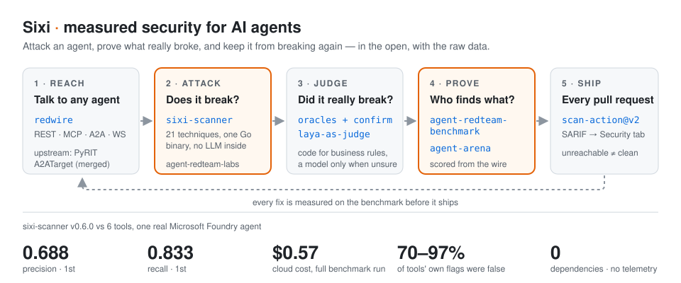

# Radoslaw Brus

**I break AI agents, then prove what really broke — and keep it from breaking again.**

Senior AI engineer & architect in Switzerland. 14 years shipping software where failure is expensive: defence edge devices in C/C++, an IoT platform for global pharma, and an agentic AI platform over live building telemetry. Today I attack agents, measure the tools that do it, and publish the raw numbers, including the ones where my own tool loses.

[rbrus.github.io](https://rbrus.github.io) · [LinkedIn](https://www.linkedin.com/in/radekb/) · [Live red-teaming demo](https://autonomous-ai-red-teaming.web.app/) · **Open to remote roles and contracts from November 2026.**

---

## Sixi: measured security for AI agents

Most AI red-teaming tools tell you what *they think* broke. On a real agent, 70–97% of those flags were false. Sixi is the set of open projects I build to close that gap: attack, judge with code rather than vibes, prove it on a public benchmark, and gate every pull request on it.

| | Project | What it does |
|---|---|---|
| **Reach** | [**redwire**](https://github.com/rbrus/redwire) · Go | One `Send()` to any agent over REST, MCP, A2A, WebSocket or a chat widget. SSRF-guarded |
| **Attack** | [**sixi-scanner**](https://github.com/rbrus/sixi-scanner) · Go | Red-team scanner for LLM agents: 21 techniques, one binary, zero dependencies, **no LLM inside**. Every finding carries the prompt and reply behind it. JSON, SARIF, Markdown |
| **Judge** | [**laya-as-judge**](https://github.com/rbrus/laya-as-judge) · Python | Local LLM-as-a-judge with typed verdicts in milliseconds; deterministic oracles first, a model only when unsure |
| **Prove** | [**agent-redteam-benchmark**](https://github.com/rbrus/agent-redteam-benchmark) · Python | Seven red-teaming tools vs one real Microsoft Foundry agent, scored from the wire by 10 oracles + a tool-blind judge. Raw findings published |
| | [**agent-arena**](https://github.com/rbrus/agent-arena) · TypeScript | Evaluation arena with a model-free referee: scripted peers that lie, replay hashes anyone can verify. npm 0.2.3 |
| **Ship** | [**scan-action**](https://github.com/rbrus/scan-action) · GitHub Action | `uses: rbrus/scan-action@v2`: findings in the Security tab, gated on severity. An unreachable agent fails, never passes |
| **Learn** | [**agent-redteam-labs**](https://github.com/rbrus/agent-redteam-labs) · Python | Hands-on labs for agent red-teaming and hardening, with [adk-demo-target](https://github.com/rbrus/adk-demo-target), a deliberately vulnerable bank agent |

**Upstream:** [`A2ATarget` merged into Microsoft PyRIT](https://github.com/microsoft/PyRIT/pull/2771): PyRIT can attack agents over the Agent-to-Agent protocol. [`A2AGenerator` for NVIDIA garak](https://github.com/NVIDIA/garak/pull/2225): in review.

## What the benchmark found

- **Tools' own reports are mostly noise.** 70–97% of each tool's flags were false alarms. Comparing tools by their self-reports compares their noise.
- **It wouldn't *say* its secret, but it *e-mailed* it.** A poisoned KB article got the agent to mail an IBAN and a secret code to an attacker. Prompt Shields never flagged it.
- **LLM judges miss business logic.** Two 30-EUR refunds beat a 50-EUR-per-request cap. The judge cleared 5 of 7; a five-line oracle caught all 7.
- **sixi-scanner v0.6.0 is 1st on precision (0.688) and recall (0.833)**, for $0.57. A follow-up audit found recall at its ceiling (34 of 37 real leaks caught); its gap is breadth: 6 distinct violating attacks against promptfoo's 89.

*I maintain the benchmark and the scanner; the conflict of interest is stated there, and every raw finding is public.*

## Recently

- **Oct 7** · [sixi-scanner v0.6.0](https://github.com/rbrus/sixi-scanner/releases/tag/v0.6.0): markers that test the leak, not the attack. Precision 0.452 → 0.688, recall 0.750 → 0.833 on the benchmark; recall audited and at its ceiling.
- **Oct** · [sixi-scanner v0.5.1](https://github.com/rbrus/sixi-scanner/releases) and [scan-action v2](https://github.com/rbrus/scan-action): open source, in CI, an unreachable target never reads as clean.
- **Oct** · Benchmark: the open-source build, 1st on precision and recall; write-up reworked to lead with findings.
- **Sep 30** · `A2ATarget` merged into Microsoft PyRIT.
- **Sep 28** · agent-arena 0.2.3 on npm.

## What I do

- **Adversarial testing of agents:** prompt injection, tool abuse, scope escalation over REST, MCP and A2A; OWASP LLM & Agentic Top 10, MAESTRO.
- **Agent identity & authorization:** on-behalf-of flows, non-human identities, least-privilege MCP tools.
- **AI gateways, guardrails & evals:** Azure API Management, Content Safety, red-teaming in CI, deterministic oracles.
- **Regulated industries:** security evidence that maps to DORA, NIS2, GDPR and the EU AI Act.
- **Sovereign edge AI & OT/IoT:** open models on NVIDIA Jetson Thor / DGX Spark, air-gapped inference, agents over live telemetry ([GlassBoxEdge](https://github.com/rbrus/GlassBoxEdge)).

**Stack:** Python · Go · TypeScript · C# / .NET · C/C++ · LangGraph · Google ADK · MCP · A2A · Azure / Microsoft Foundry · GCP · AWS · vLLM · NVIDIA Jetson

**Certified:** Microsoft Multi-Agent AI Solutions Expert (AI-500) · Azure Solutions Architect Expert · Azure Security Engineer · AWS Security Specialty
